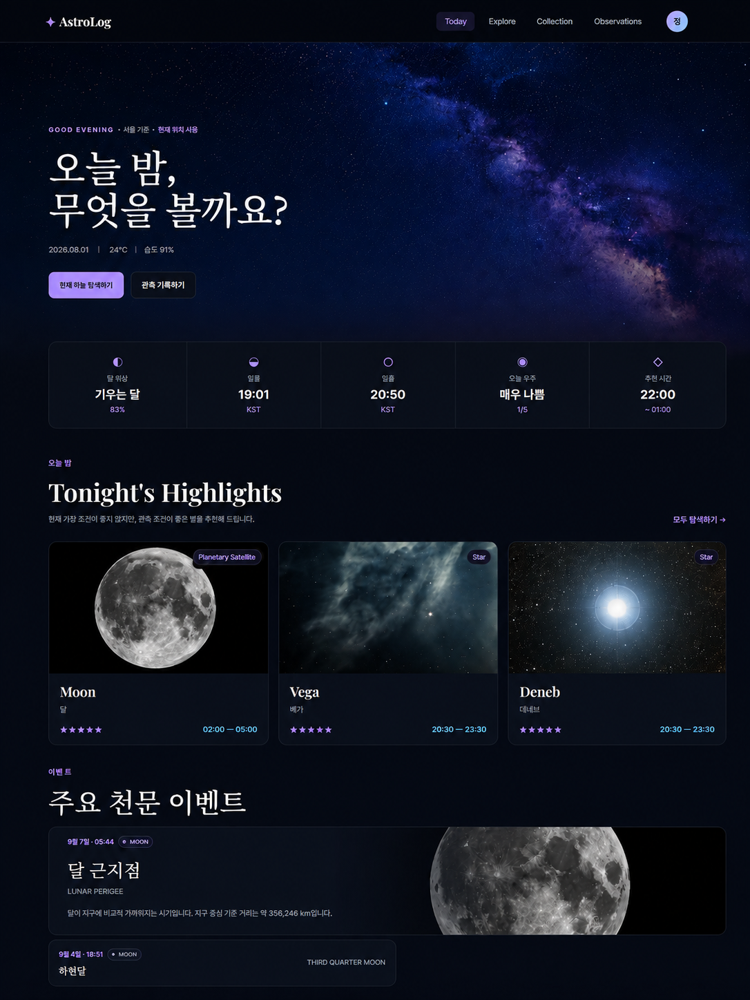
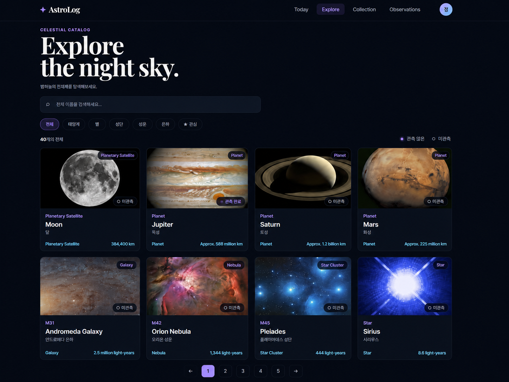
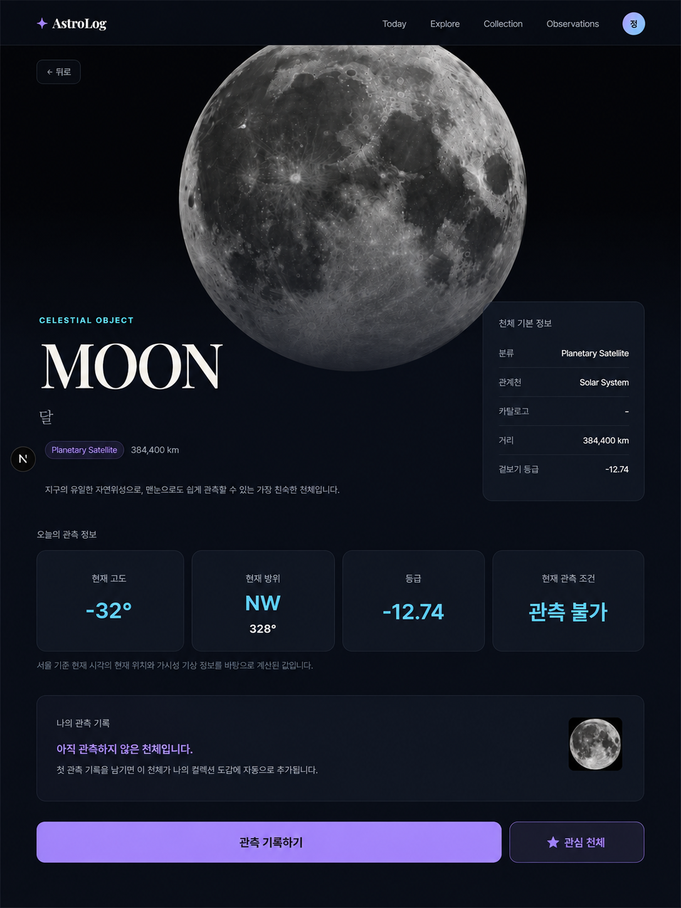
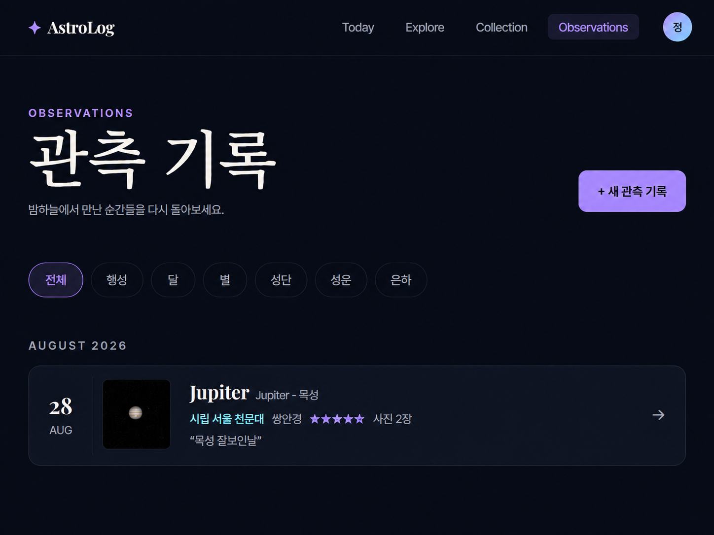
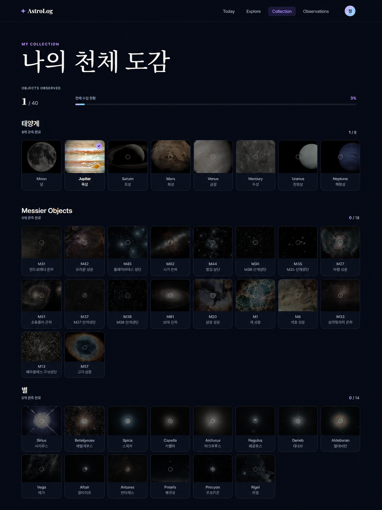
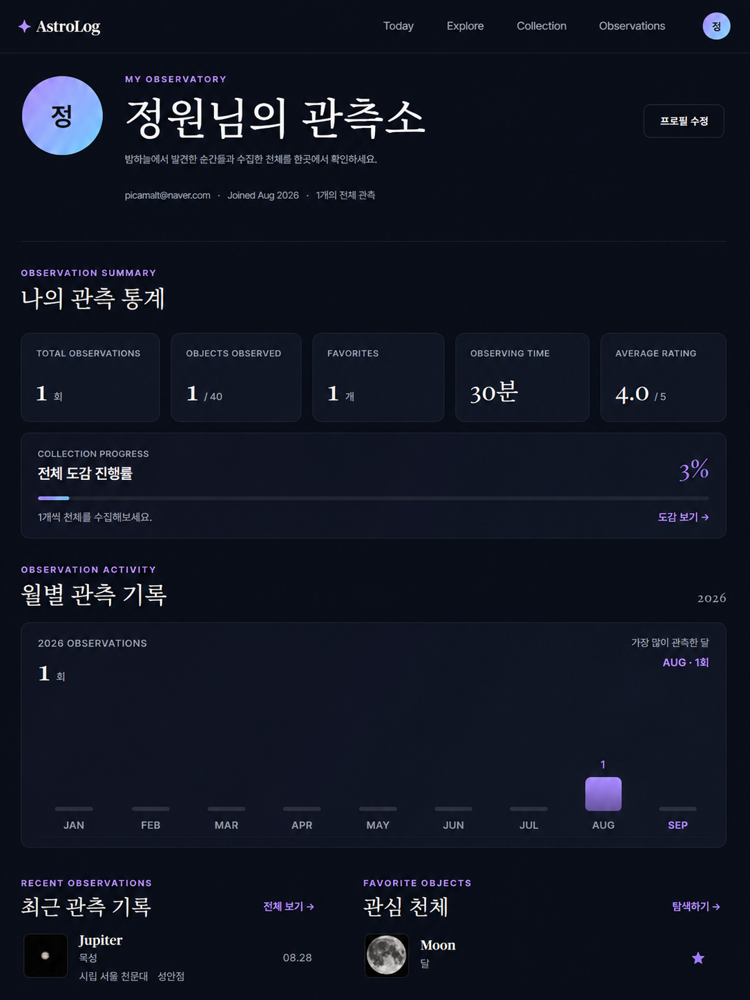
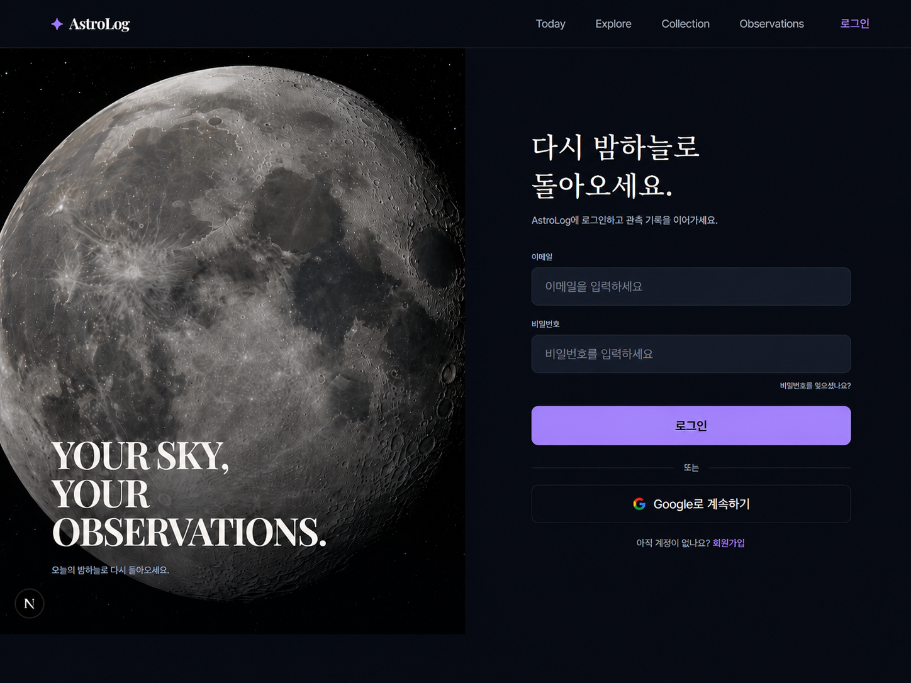

# ✦ AstroLog

> 오늘의 밤하늘을 탐색하고, 관측하고, 기록하는 개인 천문 관측 서비스

AstroLog는 천체 탐색부터 실제 관측 기록, 천체 도감 수집까지 하나의 흐름으로 연결한 천문 관측 웹 서비스입니다.

사용자의 현재 위치와 기상 정보를 기반으로 오늘 밤 관측하기 좋은 천체를 추천하고,  
관측한 천체와 기록을 모아 개인 천체 도감을 완성할 수 있습니다.

---

## 🔗 배포 링크

- Live Demo: [https://astrol-log-woad.vercel.app](https://astrol-log-woad.vercel.app)
- GitHub: [https://github.com/RaeChoe/astrol-log](https://github.com/RaeChoe/astrol-log)

---

## 📌 프로젝트 개요

기존 천문 정보 서비스는 천체에 대한 정보를 확인하는 기능에 집중되어 있지만,  
실제 관측 경험과 개인 기록까지 이어지는 경우는 많지 않습니다.

AstroLog는 다음 흐름을 중심으로 기획했습니다.

**오늘의 밤하늘 → 천체 탐색 → 관측 → 기록 → 도감 완성**

단순한 천체 정보 제공을 넘어,  
사용자가 직접 밤하늘을 관측하고 경험을 축적할 수 있도록 구성했습니다.

---

## 🛠 Tech Stack

### Frontend

- Next.js
- React
- JavaScript
- App Router
- CSS

### Backend / Database

- Supabase
  - Authentication
  - PostgreSQL Database
  - Storage
  - Row Level Security

### Astronomy / Weather

- Astronomy Engine
- SunCalc
- 기상청 단기예보 API

### Deployment

- Vercel

---

## ✨ 주요 기능

### 1. 오늘의 밤하늘

사용자의 현재 위치와 기상 정보를 기반으로 오늘의 관측 환경을 제공합니다.

- 브라우저 Geolocation 기반 현재 위치
- 위치 권한 미허용 시 서울 기준 fallback
- 현재 기온 / 습도 / 날씨
- 달 위상 및 조명률
- 일몰 / 월출 시간
- 관측 적합도
- 추천 관측 시간대

---

### 2. Tonight's Highlights

오늘 밤 실제로 관측 가능한 천체 중 추천 천체를 계산합니다.

추천에는 다음 정보를 반영합니다.

- 천체 고도
- 겉보기 등급
- 관측 가능 시간
- 시간대별 기상 조건
- 구름량
- 강수확률
- 습도
- 풍속
- 달의 조명률
- 대상 천체와 달 사이의 각거리

천문학적 관측 가치와 실제 기상 조건을 분리하여,  
별점은 천체 자체의 관측 가치로 표시하고 기상 조건은 추천 순서와 관측 시간 선정에 반영했습니다.

---

### 3. 천체 탐색

40개의 천체를 탐색할 수 있습니다.

- 천체 이름 검색
- 종류별 필터
- 태양계 / 별 / 성단 / 성운 / 은하 분류
- 관심 천체 필터
- 관측 완료 여부 표시
- 페이지네이션

---

### 4. 천체 상세 정보

각 천체의 상세 정보와 현재 관측 조건을 제공합니다.

- 천체 이름 / 분류
- 거리
- 겉보기 등급
- 설명
- 현재 고도
- 현재 방위
- 현재 관측 조건
- 관심 천체 등록
- 사용자의 최근 관측 기록

사용자의 위치에 따라 현재 고도와 방위가 동적으로 계산됩니다.

---

### 5. 관측 기록

실제 천체 관측 경험을 기록하고 관리할 수 있습니다.

- 관측 천체 선택
- 관측 일시
- 관측 장소
- 관측 장비
- 관측 시간
- 만족도
- 관측 메모
- 관측 사진 업로드
- 기록 수정 / 삭제

관측 사진은 Supabase Private Storage에 저장하며 Signed URL을 통해 사용자에게 제공합니다.

---

### 6. 나의 천체 도감

관측 기록을 기반으로 자동으로 천체 수집 현황을 계산합니다.

- 전체 천체 관측 진행률
- 태양계 수집 현황
- Messier Objects 수집 현황
- 별 수집 현황
- 관측 완료 / 미관측 상태

별도의 수집 테이블을 사용하지 않고,  
사용자의 실제 관측 기록을 기반으로 도감을 계산하도록 구성했습니다.

---

### 7. My Observatory

사용자의 활동을 한눈에 확인할 수 있는 개인 대시보드입니다.

- 프로필 / 프로필 이미지 수정
- 총 관측 횟수
- 관측한 천체 수
- 관심 천체 수
- 누적 관측 시간
- 평균 만족도
- 천체 도감 진행률
- 월별 관측 기록
- 최근 관측 기록
- 관심 천체

---

### 8. 주간 천문 이벤트

앞으로 7일 동안 발생하는 주요 천문 이벤트를 제공합니다.

- 달 위상
- 근지점 / 원지점
- 일식 / 월식
- 행성 충
- 최대이각
- 최대광도
- 행성 통과
- 절기
- 주요 유성우

희귀 이벤트는 일반 이벤트보다 강조하여 표시합니다.

---

## 📷 주요 화면

### Today



### Explore



### Object Detail



### Observations



### Collection



### My Observatory



### Login



---

## 🗄 Database Structure

```text
auth.users
   │
   ├── 1 : 1 ── profiles
   │
   ├── 1 : N ── observations
   │               │
   │               └── 1 : N ── observation_images
   │
   └── N : M ── celestial_objects
                    │
                    └── favorites

celestial_objects
   │
   └── 1 : N ── observations
```

주요 테이블:

- `profiles`
- `celestial_objects`
- `observations`
- `observation_images`
- `favorites`

---

## 💡 주요 트러블슈팅

### 1. Server Component에서 브라우저 위치 정보를 사용할 수 없는 문제

#### 문제

Next.js Server Component에서는 `navigator.geolocation`을 사용할 수 없어  
사용자의 현재 위치를 직접 가져올 수 없었습니다.

#### 해결

Client Component인 `LocationInitializer`에서 브라우저 위치 정보를 요청한 뒤  
위도와 경도를 Cookie에 저장했습니다.

서버에서는 Cookie를 통해 위치 정보를 읽고,  
`router.refresh()`를 이용해 Server Component를 다시 렌더링하도록 구성했습니다.

```text
Browser Geolocation
        ↓
LocationInitializer
        ↓
Cookie에 latitude / longitude 저장
        ↓
router.refresh()
        ↓
Server Component
        ↓
현재 위치 기반 천문 / 기상 계산
```

위치 권한이 없거나 위치 조회에 실패하면 서울 좌표를 기본값으로 사용합니다.

---

### 2. 단순한 천체 추천에서 실제 관측 환경을 고려한 추천으로 개선

#### 문제

초기 추천 시스템은 천체의 고도와 밝기를 중심으로 계산했기 때문에,  
실제로 구름이 많거나 달빛이 강한 상황에서도 높은 추천 점수가 나올 수 있었습니다.

#### 해결

추천 계산에 시간대별 기상 데이터와 달빛 영향을 추가했습니다.

- 시간별 구름량
- 강수확률
- 강수 여부
- 습도
- 풍속
- 달 조명률
- 달과 대상 천체 사이의 각거리

또한 날씨 때문에 모든 천체의 별점이 낮아지는 문제를 방지하기 위해

```text
별점 → 천문학적 관측 가치
추천 시간 / 순위 → 실제 기상 조건
```

으로 역할을 분리했습니다.

이를 통해 같은 날이라도 천체마다 서로 다른 최적 관측 시간을 추천할 수 있도록 개선했습니다.

---

### 3. Supabase Private Storage 이미지 접근 문제

#### 문제

사용자가 업로드한 관측 사진과 프로필 이미지는 개인 데이터이기 때문에  
Supabase Storage Bucket을 Public으로 설정할 수 없었습니다.

Private Bucket의 파일 경로를 그대로 ``에 전달하면 이미지를 표시할 수 없습니다.

#### 해결

DB에는 실제 URL이 아닌 Storage 내부 경로만 저장하고,  
이미지를 표시할 때 Supabase의 Signed URL을 생성했습니다.

```text
DB
↓
observation-images/user-id/image.webp
↓
createSignedUrl()
↓
임시 접근 URL
↓
브라우저 표시
```

이미지 URL 생성에 실패하는 경우에는 공통 `SafeImage` 컴포넌트를 통해 fallback 이미지를 표시하도록 처리했습니다.

---

### 4. RLS 정책을 설정했지만 데이터 요청이 실패한 문제

#### 문제

Supabase에서 Row Level Security 정책을 생성했음에도  
일부 테이블에서 요청이 정상적으로 수행되지 않는 문제가 발생했습니다.

#### 원인

RLS Policy와 PostgreSQL의 Table Grant는 서로 다른 권한 체계이며,  
Policy만 존재한다고 해서 테이블 접근 권한이 자동으로 부여되는 것은 아니었습니다.

#### 해결

각 테이블에 필요한 `GRANT` 권한과 RLS Policy를 함께 설정했습니다.

```text
Table Grant
+
RLS Policy
```

두 조건이 모두 충족된 요청만 정상적으로 수행되도록 구성했습니다.

---

## 🔐 Authentication

Supabase Authentication을 이용해 인증을 구현했습니다.

- 이메일 / 비밀번호 로그인
- 회원가입
- Google OAuth
- 로그인 사용자 전용 페이지
- 로그인 이후 원래 접근하려던 페이지로 복귀

보호 페이지:

```text
/collection
/observations
/observatory
```

배포 환경에서는 Supabase Auth의 Site URL과 Redirect URL을  
Vercel Production Domain 기준으로 설정해 OAuth 로그인 후 실제 배포 주소로 복귀하도록 구성했습니다.

---

## 🔎 SEO

Next.js Metadata API를 이용했습니다.

- 기본 Metadata
- 페이지별 Title / Description
- Dynamic Object Metadata
- Open Graph
- Twitter Card
- Canonical URL
- `sitemap.xml`
- `robots.txt`
- 로그인 / 개인 페이지 `noindex`

천체 상세 페이지에서는 해당 천체의 이름과 이미지를 이용해  
Open Graph 정보를 동적으로 생성합니다.

---

## 📂 주요 폴더 구조

```text
src/
├── app/
│   ├── collection/
│   ├── explore/
│   ├── login/
│   ├── objects/
│   │   └── [id]/
│   ├── observations/
│   ├── observatory/
│   ├── signup/
│   ├── error.js
│   ├── layout.js
│   ├── loading.js
│   ├── page.js
│   ├── robots.js
│   └── sitemap.js
│
├── components/
│   ├── celestial/
│   ├── collection/
│   ├── common/
│   ├── layout/
│   ├── observations/
│   └── observatory/
│
└── lib/
    ├── astronomy/
    ├── auth/
    ├── celestial/
    ├── supabase/
    ├── location.js
    └── site.js
```

---

## 🚀 실행 방법

```bash
npm install
npm run dev
```

`.env.local`

```env
NEXT_PUBLIC_SUPABASE_URL=
NEXT_PUBLIC_SUPABASE_PUBLISHABLE_KEY=
KMA_API_KEY=
NEXT_PUBLIC_SITE_URL=
```

`NEXT_PUBLIC_SITE_URL`은 로컬 환경에서는 생략할 수 있으며,  
Vercel 배포 환경에서는 실제 Production Domain을 등록합니다.

현재 배포 주소:

```text
https://astrol-log-woad.vercel.app
```

---

## 📝 프로젝트를 통해 경험한 것

AstroLog를 개발하며 단순한 CRUD 구현을 넘어  
외부 데이터와 사용자 데이터를 결합해 하나의 서비스 흐름으로 구성하는 경험을 할 수 있었습니다.

특히 Next.js의 Server / Client Component 경계를 고려한 위치 정보 처리,  
실제 기상 데이터와 천문 계산을 결합한 추천 로직,  
Supabase RLS와 Private Storage를 활용한 사용자 데이터 관리,  
동적 Metadata를 이용한 SEO 구현을 직접 경험했습니다.

천체를 탐색하는 것에서 끝나지 않고,  
사용자의 실제 관측 경험이 기록과 수집으로 이어지는 서비스를 구현하는 것을 목표로 했습니다.
